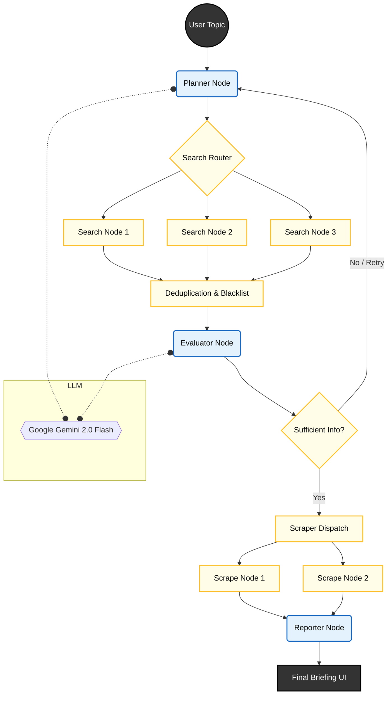

# 🌍 Autonomous Global News Briefing Agent

   

An autonomous AI agent that acts as a digital investigative journalist. Unlike simple "search wrapper" tools, this agent employs a **Plan-Act-Verify-Refine** loop to conduct deep research, critically evaluate sources, and synthesize factual reports with inline citations.

> **Key Differentiator:** Implements a **Self-Reflective Architecture** using LangGraph. If the agent finds irrelevant search results, it autonomously rejects them, rewrites its search query, and tries again—just like a human researcher.

---

## 🚀 Features

*   **🧠 Cognitive Architecture:** Uses a state machine (LangGraph) to manage the research lifecycle, not just a linear chain.
*   **🔄 Self-Correction Loop:** The "Critic" node evaluates search results for relevance. If data is insufficient, it triggers a "Re-Plan" state to change search strategies.
*   **⚡ Parallel Execution:** Uses `async` fan-out patterns to scrape and process multiple news sources simultaneously.
*   **🛡️ Hallucination Defense:** Enforces a "Filter-then-Act" workflow. Only sources that pass a strict LLM evaluation are scraped.
*   **📡 Real-Time Observability:** Frontend displays the agent's "thought process" via Server-Sent Events (SSE), showing users exactly what the AI is researching.
*   **🖼️ Multimedia Synthesis:** Extracts hero images from news sources to create a visual "News Card" interface alongside the text report.

---

## 🛠️ Tech Stack

*   **Orchestration:** [LangGraph](https://langchain-ai.github.io/langgraph/) (State Management & Cyclic Graphs)
*   **LLM Brain:** Google Gemini 2.0 Flash (1M Context Window)
*   **Search & Data:** Brave Search API (Discovery) + Jina AI (Scraping)
*   **Backend:** FastAPI (Python) with Streaming Response
*   **Frontend:** React (TypeScript) + Markdown Rendering

---

## 🧩 Architecture Flow

The system follows a strict graph topology to ensure reliability:



### Node Breakdown

1.  **Planner Node:** Analyzes the user request and generates specific search queries (e.g., converting "Apple news" to "Apple stock performance Q4 2025").
2.  **Search & Dedupe:** Fetches results and removes duplicates or previously rejected URLs (Blacklisting).
3.  **Evaluator (The Critic):** An LLM call that judges snippets. It separates "Signal" from "Noise."
4.  **Router (The Switch):**
    *   *If < 3 valid sources:* Loop back to **Planner** with instructions to try new keywords.
    *   *If >= 3 valid sources:* Proceed to scraping.
5.  **Scraper:** Extracts main text and Hero Images using Regex + BeautifulSoup.
6.  **Reporter:** Synthesizes a markdown report with Harvard-style inline citations `[1]`.

---

## 📸 Demo


---

## 💻 Installation & Setup

### Prerequisites
*   Python 3.10+
*   Node.js & npm
*   API Keys: `GOOGLE_API_KEY`, `BRAVE_API_KEY`

### Backend
```bash
# Clone repository
git clone https://github.com/yourusername/news-agent.git
cd news-agent/backend

# Install dependencies
pip install -r requirements.txt

# Run the FastAPI Server
python server.py
```

### Frontend
```bash
cd ../frontend
npm install
npm start
```

---

## 🧠 What I Learned

*   **State Management in AI:** How to use `TypedDict` and `operator.add` to maintain context across multiple autonomous loops.
*   **Conditional Routing:** Implementing logic gates in graphs to handle failure states (e.g., "Search yielded 0 results").
*   **Streaming Patterns:** Handling asynchronous data streams to push "Thought Logs" to the UI for better UX.

---

## 📜 License

MIT License.

